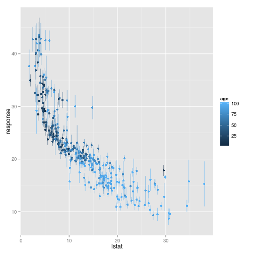

Generic bagging
========================================================

One reason why *Random Forrests* perform so well ist that they are using Bagging as a technique to gain more stability.
But why do you want to limit yourself to the classificators already implemented in well known *Random Forrests* when it is realy easy to build your one with *mlr*?

Just bag one learner already supported by *mlr* with `makeBaggingWrapper()`.

Here is how you do it:
Like in a *Random Forrests* we need a Learner which is trained on each *Bagging* iteration with a subsample of the training dataset.
The subsamples are choosen according to the following parameters used in `makeBaggingWrapper()`:
* `bag.iters` On how many subsamples do we want to train our learner?
* `bag.replace` Sample bags with replacement? (Also known as *bootstrapping*)
* `bag.size` Percentage size of the sampled bags. (*Note: When `bag.replace=TRUE`, `bag.size=1` is default which does not mean, that one bag contains all the observations as observations will occur multiple times in each bag*)
* `bag.feats` Percentage size of randomy selected features for each iteration. 

Of course we also need a `learner` which we have to pass to `makeBaggingWrapper()`.


```splus
library(mlr)
library(mlbench)  #for the datasets
data(Sonar)
tsk = makeClassifTask(data = Sonar, target = "Class")
lrn = makeLearner("classif.PART")
rsmpl = makeResampleDesc("CV", iters = 10)
bagLrn = makeBaggingWrapper(lrn, bag.iters = 50, bag.replace = TRUE, bag.size = 0.8, 
    bag.feats = 3/4, predict.type = "prob")
```

No as we have set up everything we are curious how good the bagging performs.
First let's try it without bagging:

```splus
result = resample(learner = lrn, task = tsk, resampling = rsmpl, show.info = FALSE)
result$aggr
```

```
## mmce.test.mean 
##          0.251
```

Can we improve using *mlrs bagging Wrapper*?

```splus
result = resultBagging = resample(learner = bagLrn, task = tsk, resampling = rsmpl, 
    show.info = FALSE)
result$aggr
```

```
## mmce.test.mean 
##         0.2164
```

It conusmes more time but can outperform not bagged learners on noisy data with many variables.


Additional Measures
-------------------
Using *Bagging* you can get an estimated *standard deviation* regardless of the learner.
In the following we will give a small example on a regression.


```splus
data(BostonHousing)
train.inds = seq(1, 506, 3)
test.inds = setdiff(1:nrow(BostonHousing), train.inds)
task = makeRegrTask("regrtask", data = BostonHousing, target = "medv")
lrn = makeLearner("regr.randomForest")
bagLrn = makeBaggingWrapper(lrn, predict.type = "se")
mod = train(learner = bagLrn, task = task, subset = train.inds)
pred = predict(mod, newdata = BostonHousing, subset = test.inds)
head(pred$data)
```

```
##   truth response     se
## 1  21.6    22.43 0.4203
## 2  34.7    34.53 1.4286
## 3  36.2    33.08 0.4778
## 4  28.7    26.50 1.0213
## 5  27.1    18.32 0.5842
## 6  16.5    16.58 0.3969
```

In the column labled `se` the standard deviation for each prediction (`response`) is given.

Let us visualise this a bit using [ggplot2](http://ggplot2.org/).
Here we plot the *percentage of lower status of the population* (`lstat`) against the prediction.

```splus
library("ggplot2")
```

```
## 
## Attaching package: 'ggplot2'
## 
## Das folgende Objekt ist maskiert from 'package:mboost':
## 
##     %+%
```

```splus
library("reshape2")
data = cbind(pred$data, BostonHousing[test.inds, ])
g = ggplot(data, aes(x = lstat, y = response, ymin = response - se, ymax = response + 
    se, col = age))
g + geom_point() + geom_linerange(alpha = 0.5)
```

 

For more details about the data see `?BostonHousing`.

