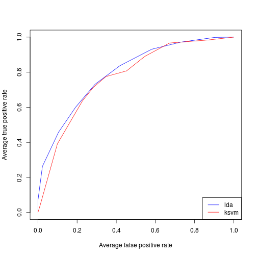
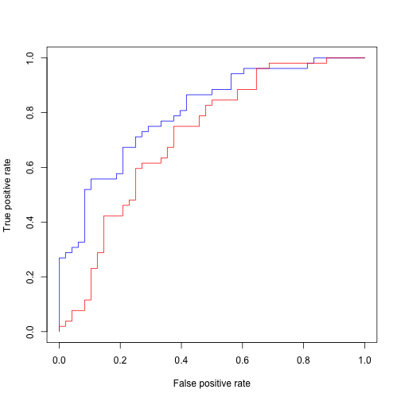

ROC Analysis
============

The receiver operating characteristic (ROC) Curve is a graphical plot
for a binary classifier and mainly used in signal detection theory. It
compares the false positive rate (fall-out) on the horizontal axis to
the true positive rate (sensitivity) on the vertical axis by varying
the threshold. Sometimes, costs of misclassification are unknown. So,
in contrast to performance measures, where you can calculate only one
performance value, a ROC Curve for one classifier shows an area of
performance values in dependencies to different false positive and true
positive rates. Another positive aspect for this graphical plot is the
fact, that it can compare the performance of an imbalanced data set
with a modified version. The following functions are created by
including the features of the [ROCR](http://cran.r-project.org/web/packages/ROCR/index.html)-Package.

Comparing to learners
---------------------

You can easely compare the Performance of two learners with `mlr` and the help of `ROCR`.
First we create a scenario with two different [learners](learner.md) capable of predicting probabilities (Tip: run `listLearners(prob=TRUE)` to get a list of all supported learners doing so).

```splus
library("mlbench")
library("ROCR")
```

```
## Loading required package: gplots
## 
## Attaching package: 'gplots'
## 
## Das folgende Objekt ist maskiert from 'package:plotrix':
## 
##     plotCI
## 
## Das folgende Objekt ist maskiert from 'package:stats':
## 
##     lowess
## 
## 
## Attaching package: 'ROCR'
## 
## Das folgende Objekt ist maskiert from 'package:mlr':
## 
##     performance
```

```splus
library("mlr")

## Generate 2 class problem with mlbench
set.seed(1)
testData = as.data.frame(mlbench.2dnormals(100, sd = 2))

## Define a learning task and an appropriate learner
task = makeClassifTask(data = testData, target = "classes")
lrn1 = makeLearner("classif.lda", predict.type = "prob")
lrn2 = makeLearner("classif.ksvm", predict.type = "prob")
```


Afterwards we perform [resampling](resample.md) to obtain predictions for each fold.

```splus
## Perform a 10-fold cross-validation
rdesc = makeResampleDesc("CV", iters = 10)
r1 = resample(lrn1, task, rdesc)
```

```
## [Resample] cross-validation iter: 1
## [Resample] cross-validation iter: 2
## [Resample] cross-validation iter: 3
## [Resample] cross-validation iter: 4
## [Resample] cross-validation iter: 5
## [Resample] cross-validation iter: 6
## [Resample] cross-validation iter: 7
## [Resample] cross-validation iter: 8
## [Resample] cross-validation iter: 9
## [Resample] cross-validation iter: 10
## [Resample] Result: mmce.test.mean=0.27
```

```splus
r2 = resample(lrn2, task, rdesc)
```

```
## [Resample] cross-validation iter: 1
```

```
## Using automatic sigma estimation (sigest) for RBF or laplace kernel
```

```
## [Resample] cross-validation iter: 2
```

```
## Using automatic sigma estimation (sigest) for RBF or laplace kernel
```

```
## [Resample] cross-validation iter: 3
```

```
## Using automatic sigma estimation (sigest) for RBF or laplace kernel
```

```
## [Resample] cross-validation iter: 4
```

```
## Using automatic sigma estimation (sigest) for RBF or laplace kernel
```

```
## [Resample] cross-validation iter: 5
```

```
## Using automatic sigma estimation (sigest) for RBF or laplace kernel
```

```
## [Resample] cross-validation iter: 6
```

```
## Using automatic sigma estimation (sigest) for RBF or laplace kernel
```

```
## [Resample] cross-validation iter: 7
```

```
## Using automatic sigma estimation (sigest) for RBF or laplace kernel
```

```
## [Resample] cross-validation iter: 8
```

```
## Using automatic sigma estimation (sigest) for RBF or laplace kernel
```

```
## [Resample] cross-validation iter: 9
```

```
## Using automatic sigma estimation (sigest) for RBF or laplace kernel
```

```
## [Resample] cross-validation iter: 10
```

```
## Using automatic sigma estimation (sigest) for RBF or laplace kernel
```

```
## [Resample] Result: mmce.test.mean=0.32
```


Now we have to convert each prediction within the resample-result to a ROCR prediction using the `asROCRPrediction()` function.
Afterwards we let `ROCR` calculate the performance measures and plot the ROC Curve.
As we have one curve for each learner and each cross validation fold we might want to average the curves from the cross validation by using `avg="threshold"`.
Otherwise `plot.performance()` will draw one curve for each fold.
For details view `?plot.performance`.


```splus
p1 = asROCRPrediction(r1$pred)
p2 = asROCRPrediction(r2$pred)
perf1 = ROCR::performance(p1, "tpr", "fpr")
perf2 = ROCR::performance(p2, "tpr", "fpr")
plot(perf1, col = "blue", avg = "threshold")
plot(perf2, col = "red", avg = "threshold", add = TRUE)
legend("bottomright", legend = c("lda", "ksvm"), lty = 1, col = c("blue", "red"))
```

 


We can also cheat a bit and create pooled ROC-Curves by manually setting the class attribute from the prediction object from `ResamplePrediction` to `Prediction`.

```splus
r1p = r1$pred
r2p = r2$pred
class(r1p) = "Prediction"
class(r2p) = "Prediction"
p1 = asROCRPrediction(r1p)
p2 = asROCRPrediction(r2p)
perf1 = ROCR::performance(p1, "tpr", "fpr")
perf2 = ROCR::performance(p2, "tpr", "fpr")
plot(perf1, col = "blue")
plot(perf2, col = "red", add = TRUE)
```

 


