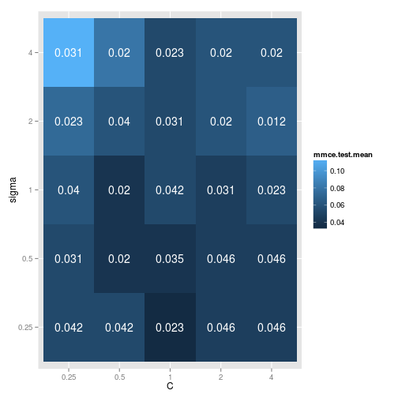
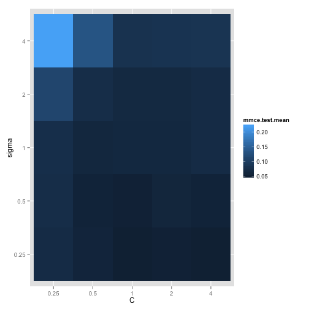

Tuning Hyperparameters
======================

Many classification algorithms feature a set of hyperparameters that
either need to be selected by the user or through resampling,
e.g. cross-validation. Setting them by hand was already covered in the
section about [training](train.md) and [resampling](resample.md) -- simply use the
`par.val` argument in the [makeLearner](http://berndbischl.github.io/mlr/man/makeLearner.html) method.

Assuming, you have understood how [resampling](resample.md) works, it is
quite simple to implement a grid search, which is one of the standard
-- albeit slow -- ways to choose an appropriate set of parameters from a
given range of values.


Classification example
----------------------

We again use the iris data set, included in R, but now, we want to
tune a SVM with a polynomial kernel.

### Simple Grid Search witch Cross Validation

We start by loading the *mlr* package and creating a classification
task, just like in the tutorial on [training](train.md):


```splus
library("mlr")
task = makeClassifTask(data = iris, target = "Species")
```


Next, we need to create a [ParamSet](http://berndbischl.github.io/ParamHelpers/man/makeParamSet.html) object, which describes the parameter space 
we wish to search in. This is done via the function [makeParamSet](http://berndbischl.github.io/ParamHelpers/man/makeParamSet.html).
Since we will use a grid search strategy, we add a discrete parameter for the 
`C` and `sigma` parameter of the SVM to the parameter set.
More details concerning parameter sets are explained in section [parameters](parameters.md).


```splus
ps = makeParamSet(makeDiscreteParam("C", values = 2^(-2:2)), makeDiscreteParam("sigma", 
    values = 2^(-2:2)))
```


We will use cross-validation to assess the quality of a parameter
combination. For this we need to create a resampling description just
like in the [resampling](resample.md) part of the tutorial:


```splus
rdesc = makeResampleDesc("CV", iters = 3)
```


Before we can actually tune our classifier, we need an instance of a
[TuneControl](http://berndbischl.github.io/mlr/man/TuneControl.html) object. These describe the optimization strategy
used. Here we use a grid search:


```splus
ctrl = makeTuneControlGrid()
```


Finally, by combining all the previous pieces, we can tune the SVM
using our [TuneControl](http://berndbischl.github.io/mlr/man/TuneControl.html) instance and the resampling strategy,
described by the `rdesc` variable.


```splus
r = tuneParams(makeLearner("classif.ksvm"), task = task, resampling = rdesc, 
    par.set = ps, control = ctrl, measures = list(mmce, setAggregation(mmce, 
        test.sd)))
```

```
## [Tune] Started tuning learner classif.ksvm for parameter set:
##           Type len Def         Constr Req Trafo
## C     discrete   -   - 0.25,0.5,1,2,4   -     -
## sigma discrete   -   - 0.25,0.5,1,2,4   -     -
## With control class: TuneControlGrid
## [Tune] 1: C=0.25; sigma=0.25 : mmce.test.mean=0.0533,mmce.test.sd=0.0503
## [Tune] 2: C=0.5; sigma=0.25 : mmce.test.mean=0.06,mmce.test.sd=0.04
## [Tune] 3: C=1; sigma=0.25 : mmce.test.mean=0.0333,mmce.test.sd=0.0115
## [Tune] 4: C=2; sigma=0.25 : mmce.test.mean=0.0467,mmce.test.sd=0.0231
## [Tune] 5: C=4; sigma=0.25 : mmce.test.mean=0.04,mmce.test.sd=0.02
## [Tune] 6: C=0.25; sigma=0.5 : mmce.test.mean=0.0667,mmce.test.sd=0.0306
## [Tune] 7: C=0.5; sigma=0.5 : mmce.test.mean=0.06,mmce.test.sd=0.02
## [Tune] 8: C=1; sigma=0.5 : mmce.test.mean=0.0467,mmce.test.sd=0.0115
## [Tune] 9: C=2; sigma=0.5 : mmce.test.mean=0.04,mmce.test.sd=0.02
## [Tune] 10: C=4; sigma=0.5 : mmce.test.mean=0.04,mmce.test.sd=0.02
## [Tune] 11: C=0.25; sigma=1 : mmce.test.mean=0.0867,mmce.test.sd=0.0231
## [Tune] 12: C=0.5; sigma=1 : mmce.test.mean=0.0667,mmce.test.sd=0.0115
## [Tune] 13: C=1; sigma=1 : mmce.test.mean=0.06,mmce.test.sd=0.02
## [Tune] 14: C=2; sigma=1 : mmce.test.mean=0.06,mmce.test.sd=0.02
## [Tune] 15: C=4; sigma=1 : mmce.test.mean=0.0733,mmce.test.sd=0.0231
## [Tune] 16: C=0.25; sigma=2 : mmce.test.mean= 0.1,mmce.test.sd=0.0346
## [Tune] 17: C=0.5; sigma=2 : mmce.test.mean=0.0867,mmce.test.sd=0.0306
## [Tune] 18: C=1; sigma=2 : mmce.test.mean=0.08,mmce.test.sd=0.0346
## [Tune] 19: C=2; sigma=2 : mmce.test.mean=0.08,mmce.test.sd=0.0346
## [Tune] 20: C=4; sigma=2 : mmce.test.mean=0.08,mmce.test.sd=0.0346
## [Tune] 21: C=0.25; sigma=4 : mmce.test.mean=0.16,mmce.test.sd=0.06
## [Tune] 22: C=0.5; sigma=4 : mmce.test.mean=0.107,mmce.test.sd=0.0503
## [Tune] 23: C=1; sigma=4 : mmce.test.mean=0.0933,mmce.test.sd=0.0611
## [Tune] 24: C=2; sigma=4 : mmce.test.mean=0.0933,mmce.test.sd=0.0611
## [Tune] 25: C=4; sigma=4 : mmce.test.mean= 0.1,mmce.test.sd=0.0529
## [Tune] Result: C=1; sigma=0.25 : mmce.test.mean=0.0333,mmce.test.sd=0.0115
```


We used a trick also described [here](multicriteria_evaluation.md) to also obtain the Standard Deviation by adding a second measure.
A quick visualization of the Grid Search can be achived by accessing the opt.path as follows

```splus
library(ggplot2)
head((opt.grid = as.data.frame(r$opt.path)))
```

```
##      C sigma mmce.test.mean mmce.test.sd dob eol
## 1 0.25  0.25        0.05333      0.05033   1  NA
## 2  0.5  0.25        0.06000      0.04000   2  NA
## 3    1  0.25        0.03333      0.01155   3  NA
## 4    2  0.25        0.04667      0.02309   4  NA
## 5    4  0.25        0.04000      0.02000   5  NA
## 6 0.25   0.5        0.06667      0.03055   6  NA
```

```splus
g = ggplot(opt.grid, aes(x = C, y = sigma, fill = mmce.test.mean, label = round(mmce.test.sd, 
    3)))
g + geom_tile() + geom_text(color = "white")
```

 

Let's take another closer look at the example above. The parameter grid has
to be a named list, where every entry has to be named according to the
corresponding parameter of the underlying R function (in this case
"ksvm" from the kernlab package, see its respective help page).  Its
value is a vector of feasible values for this hyperparameter. The
complete grid is just the cross-product of all feasible values.

(Please note whenever parameters in the underlaying R functions should be 
passed within a list structure *mlr* tries to give you direct access to
each parameter and get rid of the list structure -- Like this is the case with `ksvm`) 

Tune now simply performs the cross-validation for every element of the
cross-product and selects the one with the best mean performance
measure.

Unfortunately, it's not clear, how reliable the results are. One might
want to find out, if the configurations vary for slightly different data sets.
A good approach for getting a better feeling of the best parameter setting
would be a nested cross-validation.

### Nested Cross Validation

Let's run a nested CV with 5 folds in the outer loop and 3 folds in the
inner loop on the example from above.


```splus
task = makeClassifTask(data = iris, target = "Species")
ps = makeParamSet(makeDiscreteParam("C", values = 2^(-2:2)), makeDiscreteParam("sigma", 
    values = 2^(-2:2)))
ctrl = makeTuneControlGrid()

rin = makeResampleDesc("CV", iters = 3)
rout = makeResampleDesc("CV", iters = 5)

lrn = makeTuneWrapper(makeLearner("classif.ksvm"), resampling = rin, par.set = ps, 
    control = ctrl, show.info = FALSE)
```


Now, we can run our nested CV. For further evaluations, we might
want to extract the tune results as well. Please note, that storing the
entire models might be expensive.


```splus
r = resample(lrn, task, resampling = rout, extract = getTuneResult, show.info = FALSE)
```


Finally, we can compare our results. We receive one optimal setting for
each of the 5 outer folds, including the corresponding mmce on the inner
cross-validations:


```splus
r$extract
```

```
## [[1]]
## Tune result:
## Op. pars: C=0.25; sigma=0.25
## mmce.test.mean=0.0417
## 
## [[2]]
## Tune result:
## Op. pars: C=1; sigma=0.25
## mmce.test.mean=0.0167
## 
## [[3]]
## Tune result:
## Op. pars: C=0.25; sigma=0.25
## mmce.test.mean=0.05
## 
## [[4]]
## Tune result:
## Op. pars: C=0.5; sigma=0.25
## mmce.test.mean=0.0333
## 
## [[5]]
## Tune result:
## Op. pars: C=2; sigma=0.25
## mmce.test.mean=0.0417
```


As you can see, the optimal configuration usually differs based on the data.
But you might be able to find a range of the best settings, e.g. the values
for C should be at least 1 and the values for sigma should be between 0 and 1.

If we want to find out, how good those configurations are on the entire data
set, we might still look at the measures that we already know from
[Resampling](resample.md).


```splus
r$measures.test
```

```
##   iter    mmce
## 1    1 0.00000
## 2    2 0.10000
## 3    3 0.00000
## 4    4 0.03333
## 5    5 0.03333
```

```splus
r$aggr
```

```
## mmce.test.mean 
##        0.03333
```


Thus, we receive 5 misclassification errors (one for each optimal parameter
configuration per outer fold) and one aggregated version, i.e. the mean,
of those 5 values.

#### Visualization

To extract the `opt.path`s we have to access the inner cross validations.

```splus
opt.paths = lapply(r$extract, function(x) as.data.frame(x$opt.path))
opt.mmce = lapply(opt.paths, function(x) x$mmce.test.mean)
opt.grid = opt.paths[[1]][, 1:2]
opt.grid$mmce.test.mean = apply(simplify2array(opt.mmce), 1, mean)
g = ggplot(opt.grid, aes(x = C, y = sigma, fill = mmce.test.mean))
g + geom_tile()
```

 


Regression example
------------------

Let's tune `k` of a `k`-nearest-neighbor-regression model (implemented
in package ``kknn``) on the ``BostonHousing`` data set.


```splus
library("mlbench")
data(BostonHousing)

task = makeRegrTask(data = BostonHousing, target = "medv")

## Range of the value k
ps = makeParamSet(makeDiscreteParam("k", 1:7))

## Evaluate with 5-fold cross-validation
rdesc = makeResampleDesc("CV", iters = 5)

## Create a grid tuner:
ctrl = makeTuneControlGrid()

## Create a learner:
lrn = makeLearner("regr.kknn")

## Tune k-nearest-neighbor-regression with mean squared error as default
## measure
tuneParams(learner = lrn, task = task, resampling = rdesc, par.set = ps, control = ctrl, 
    measures = mse)
```


<!--(
.. |tune-varsel_processing| image:: /_images/tune-varsel_processing.png
     :align: middle
     :width: 50em
     :alt: Variable selection as a tuning.
     
)-->
